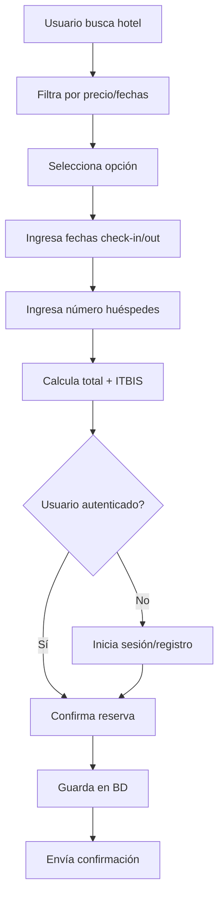
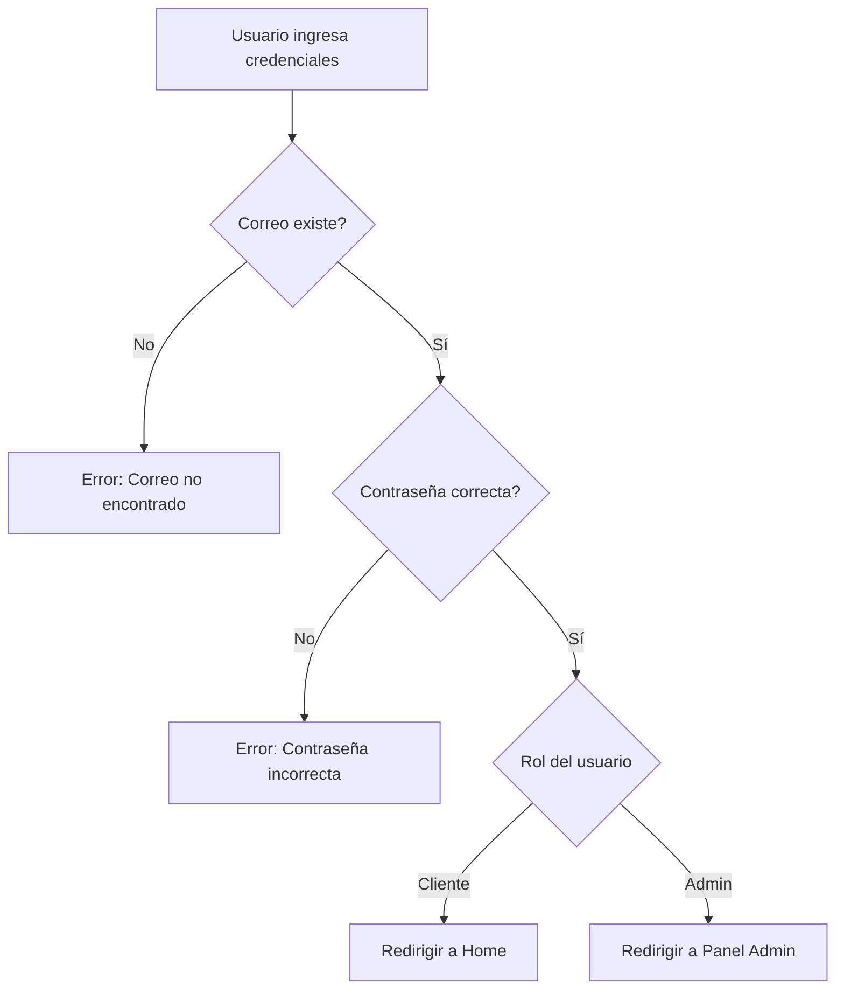

# Comprensión Inicial del Dominio - RutaRD

## 🌍 Visión General del Proyecto

**RutaRD** es una plataforma de turismo digital enfocada en **Puerto Plata, República Dominicana**, que sirve como guía integral para turistas nacionales e internacionales. El sistema conecta a visitantes con servicios turísticos locales, facilitando la planificación, reserva y disfrute de experiencias turísticas auténticas.

---

## 🎯 Misión y Propósito

### Misión
> "Ser la guía digital definitiva para descubrir y disfrutar Puerto Plata, conectando turistas con lo mejor de la cultura, naturaleza y hospitalidad dominicana."

### Propósito del Sistema
1. **Centralizar información turística** de Puerto Plata en una plataforma moderna
2. **Facilitar reservas** de alojamiento de manera transparente
3. **Promover turismo ecológico y cultural** de la región
4. **Brindar herramientas administrativas** para gestionar servicios turísticos
5. **Crear comunidad** mediante reseñas y evaluaciones auténticas

---

## 👥 Actores del Sistema

### 1. Turistas/Clientes (Usuarios Regulares)

**Perfil:**
- Visitantes nacionales o internacionales
- Buscan experiencias turísticas en Puerto Plata
- Pueden o no estar familiarizados con la zona

**Necesidades:**
- Encontrar alojamiento según presupuesto
- Descubrir restaurantes y gastronomía local
- Explorar turismo ecológico (playas, senderismo)
- Conocer sitios culturales e históricos
- Informarse sobre eventos locales
- Hacer reservas de manera sencilla
- Leer reseñas de otros turistas

**Permisos:**
- Ver todo el catálogo de servicios
- Hacer reservas de hoteles
- Dejar reseñas y calificaciones
- Registrarse y autenticarse

---

### 2. Administradores

**Perfil:**
- Personal del equipo RutaRD
- Responsables de mantener la plataforma actualizada
- Gestores de contenido y relaciones comerciales

**Necesidades:**
- Gestionar información de hoteles, restaurantes, eventos
- Moderar reseñas inapropiadas
- Ver estadísticas de uso y reservas
- Crear cuentas de administrador
- Actualizar precios y disponibilidad

**Permisos:**
- CRUD completo de servicios turísticos
- Gestión de usuarios
- Panel de administración
- Acceso a reportes y métricas

---

## 🏗️ Dominio del Negocio

### Categorías de Servicios Turísticos

#### 1. 🏨 Alojamiento (Hoteles)
**Descripción:** Servicios de hospedaje para turistas

**Atributos Relevantes:**
- Precio por noche (variable según temporada)
- Nivel de estrellas (calidad)
- Ubicación geográfica
- Servicios adicionales (WiFi, desayuno, piscina, tours)
- Imágenes representativas
- Reseñas de huéspedes anteriores

**Casos de Uso:**
- Búsqueda por rango de precios
- Filtrado por estrellas
- Comparación de opciones
- Reserva de fechas específicas
- Cálculo de ITBIS (18% RD)

---

#### 2. 🍽️ Gastronomía (Restaurantes)
**Descripción:** Opciones de comida local e internacional

**Atributos Relevantes:**
- Tipo de cocina (dominicana, italiana, mariscos)
- Rango de precios ($, $$, $$$)
- Horario de atención
- Calificación por estrellas
- Ubicación accesible
- Especialidades de la casa

**Casos de Uso:**
- Descubrir opciones cercanas
- Buscar tipo de cocina específico
- Ver horarios para planificar visitas
- Leer reseñas de comensales

---

#### 3. 🌿 Turismo Ecológico
**Descripción:** Actividades en contacto con la naturaleza

**Atributos Relevantes:**
- Tipo de actividad (playa, senderismo, cascadas, cuevas)
- Nivel de dificultad (fácil, medio, difícil)
- Requisitos especiales (equipo, condición física)
- Precios por persona o grupo
- Mejor época del año para visitar

**Casos de Uso:**
- Planificar aventuras al aire libre
- Conocer-playas ocultas y cascadas
- Evaluar dificultad según capacidades
- Reservar tours guiados

**Ejemplos en Puerto Plata:**
- Playa Dorada
- Cayo Arena
- 27 Charcos de Damajagua
- Isabel de Torres

---

#### 4. 🏛️ Turismo Cultural
**Descripción:** Sitios de interés histórico y cultural

**Atributos Relevantes:**
- Tipo de sitio (museo, monumento, fortaleza)
- Horario de visitas
- Precio de entrada
- Importancia histórica
- Guías disponibles

**Casos de Uso:**
- Itinerarios históricos
- Planificación de visitas guiadas
- Conocer historia local
- Actividades educativas

**Ejemplos en Puerto Plata:**
- Fortaleza San Felipe
- Amber Museum
- Centro histórico de Puerto Plata
- Teleférico Isabel de Torres

---

#### 5. 🎉 Eventos y Actividades
**Descripción:** Eventos especiales y actividades temporales

**Atributos Relevantes:**
- Fecha y hora específica
- Tipo de evento (conciertos, ferias, festivales)
- Ubicación del evento
- Precio de entrada
- Capacidad limitada

**Casos de Uso:**
- Descubrir qué pasa durante tu visita
- Comprar entradas anticipadas
- Planificar según fechas
- Recibir notificaciones de eventos

---

## 💡 Procesos Clave del Negocio

### 1. Proceso de Reserva de Hotel

**Reglas de Negocio:**
- Check-in debe ser fecha futura
- Check-out posterior a check-in
- ITBIS siempre 18%
- Estado inicial: 'Pendiente'
- Usuario solo puede cancelar sus propias reservas

---

### 2. Proceso de Autenticación

**Reglas de Negocio:**
- Contraseña mínimo 6 caracteres
- Correo debe ser único
- Contraseña almacenada con BCrypt
- Sesión persiste en localStorage
- Roles: Cliente o Administrador

---

### 3. Proceso de Reseñas

**Sistema Polimórfico:**
- Un usuario puede reseñar cualquier entidad (Hotel, Restaurante, etc.)
- Calificación del 1.0 al 5.0
- Comentario textual opcional
- Reseña asociada a usuario_id
- Moderación por administradores

**Impacto en Negocio:**
- Mejora confianza en la plataforma
- Genera contenido UGC (User Generated Content)
- Influye en decisiones de otros turistas

---

## 📊 Entidades del Dominio

### Usuarios
- **Atributos:** nombre, correo (único), contraseña (hasheada), rol, fecha_registro
- **Tipos:** Cliente, Administrador
- **Relaciones:** Uno a muchos con Reservas y Reseñas

### Hoteles
- **Atributos:** nombre, dirección, precio_noche, estrellas, imagen_url
- **Relaciones:** Uno a muchos con Servicios, Reservas, Reseñas

### Servicios de Hotel
- **Atributos:** nombre, descripcion, cargo_extra
- **Relaciones:** Muchos a uno con Hotel

### Restaurantes
- **Atributos:** nombre, tipo_cocina, rango_precio, horario, estrellas
- **Relaciones:** Uno a muchos con Reseñas

### Turismo Ecológico/Cultural/Eventos
- **Atributos:** nombre, ubicacion, precio, imagen_url
- **Relaciones:** Uno a muchos con Reseñas

### Reseñas (Polimórfica)
- **Atributos:** categoria_id, categoria_tipo, comentario, calificacion
- **Relaciones:** Muchos a uno con Usuario, polimórfica con entidades

### Reservas
- **Atributos:** check_in, check_out, numero_huespedes, total, itbis, estado
- **Relaciones:** Muchos a uno con Usuario y Hotel

---

## 💰 Aspectos Financieros

### ITBIS (Impuesto)
- **Tasa:** 18% en República Dominicana
- **Aplicación:** Sobre servicios turísticos
- **Cálculo:** `total_con_itbis = total_estimado * 1.18`

### Precios
- **Moneda:** Dólares estadounidenses (USD)
- **Precisión:** 2 decimales (DECIMAL 10,2)
- **Variabilidad:** Según temporada, tipo de habitación, servicios

---

## 🎨 Características Únicas del Dominio

### 1. Enfoque Local
- Exclusivo para Puerto Plata
- Conocimiento profundo de la zona
- Recomendaciones personalizadas

### 2. Multidisciplinario
- No es solo reservas de hotel
- Incluye gastronomía, naturaleza, cultura
- Experiencia integral del destino

### 3. Comunidad
- Sistema de reseñas genera confianza
- Turistas recomiendan a turistas
- Feedback continuo mejora calidad

### 4. Tecnológico
- Plataforma web moderna (Blazor)
- Base de datos robusta (PostgreSQL)
- Autenticación segura (BCrypt)
- Responsive design

---

## 🚌 Restricciones y Reglas

### Restricciones Técnicas
- Frontend: Blazor WebAssembly
- Backend: ASP.NET Core 10
- BD: PostgreSQL 16+
- ORM: Entity Framework Core

### Reglas de Negocio
1. **Un usuario = Un rol**
2. **Reserva sin usuario no existe**
3. **No se pueden eliminar entidades con reservas**
4. **Las contraseñas nunca se muestran**
5. **ITBIS es obligatorio en República Dominicana**
6. **Check-out debe ser posterior a check-in**

---

## 📈 Métricas de Éxito

### KPIs Principales
1. **Número de reservas completadas** por mes
2. **Promedio de calificación** de servicios
3. **Usuarios activos** registrados
4. **Tiempo promedio** de navegación
5. **Tasa de conversión** visita → reserva

### Métricas de Calidad
1. **Precisión de información** de servicios
2. **Tiempo de respuesta** del sistema
3. **Satisfacción de usuarios** (reseñas)
4. **Disponibilidad** del sistema (uptime)

---

## 🎯 Objetivos del Proyecto

### Corto Plazo (1-3 meses)
- ✅ Autenticación funcional
- ✅ Catálogo de servicios completo
- ✅ Sistema de reservas operativo
- ✅ Panel administrativo básico

### Mediano Plazo (3-6 meses)
- 🔄 Integración pasarela de pago
- 🔄 Notificaciones por email
- 🔄 Mapas interactivos
- 🔄 Chat de soporte

### Largo Plazo (6-12 meses)
- 📱 App móvil nativa
- 🌍 Expandir a otros destinos
- 🤖 IA para recomendaciones
- 📊 Analytics avanzado

---

## 🌟 Ventaja Competitiva

### Diferenciadores
1. **Especialización** en Puerto Plata (no es TripAdvisor genérico)
2. **Integración** de todos los servicios en un lugar
3. **Enfoque** en turismo auténtico (ecológico, cultural)
4. **Tecnología** moderna y fácil de usar
5. **Comunidad** local de turistas reales

### Propuesta de Valor
> "Descubre Puerto Plata como un local, con toda la información que necesitas en un solo lugar, desde hoteles hasta playas ocultas, reseñado por turistas reales."

---

**Documento:** Comprensión Inicial del Dominio
**Versión:** 1.0
**Fecha:** 27 de marzo de 2026
**Autor:** RutaRD Development Team
