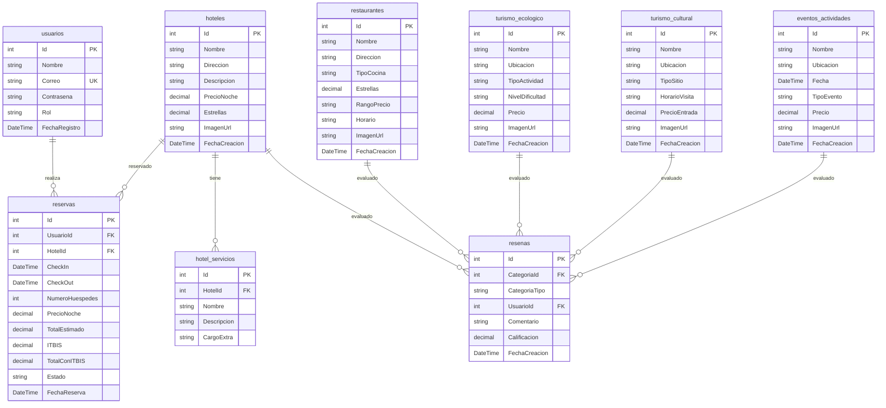
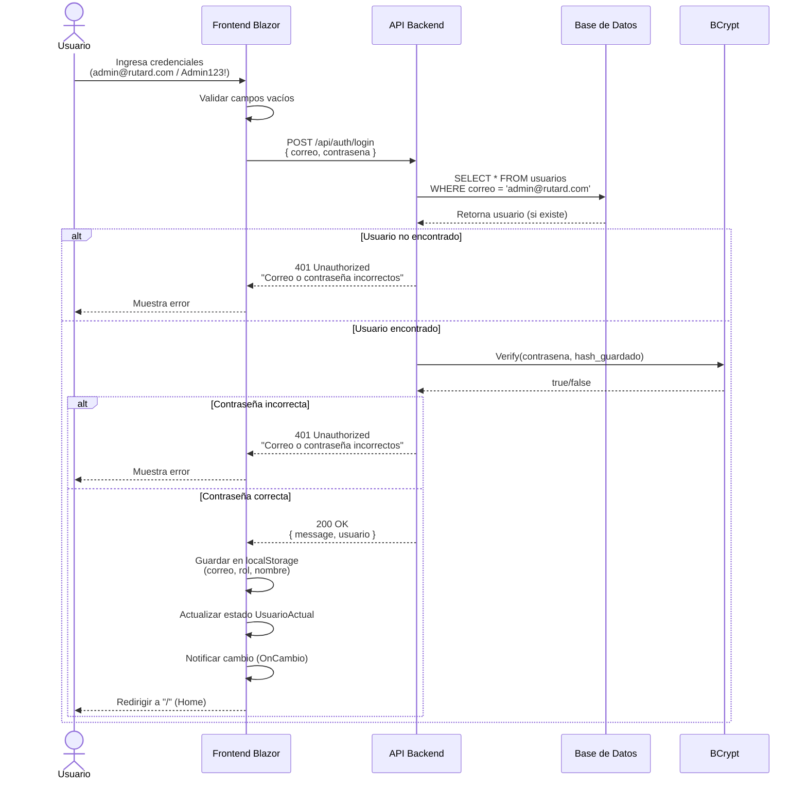
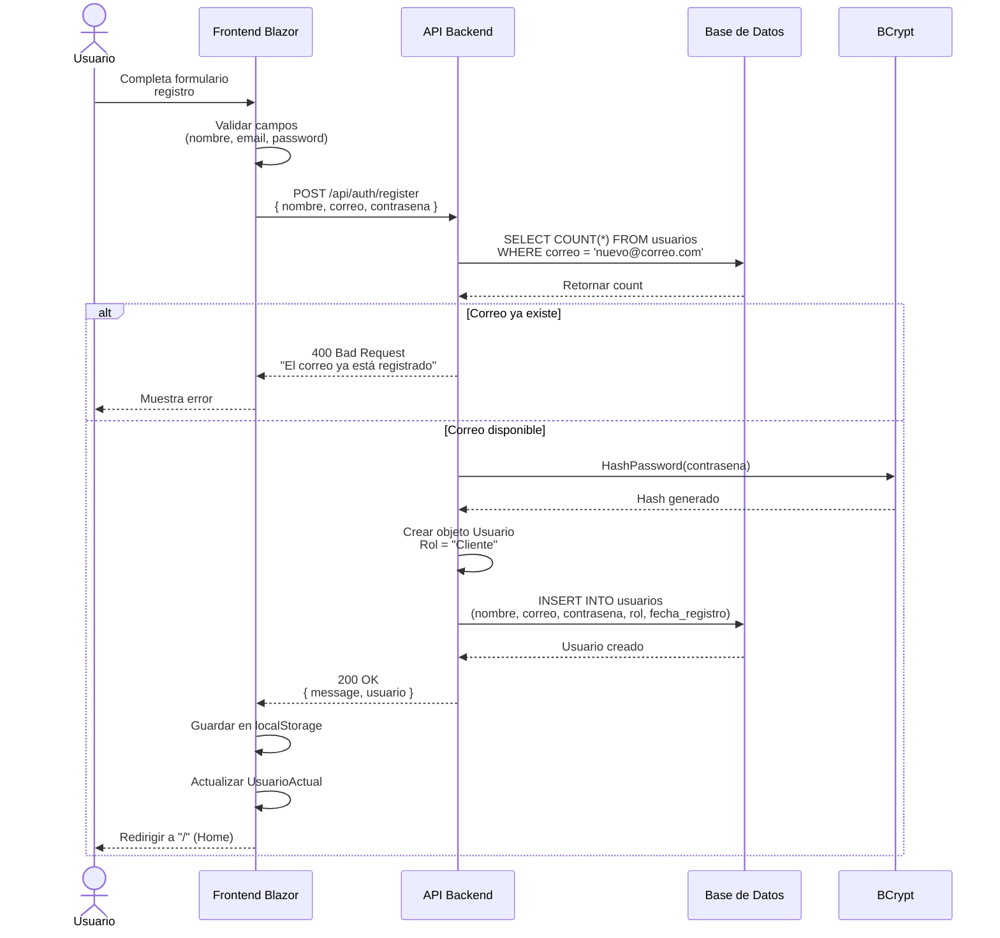
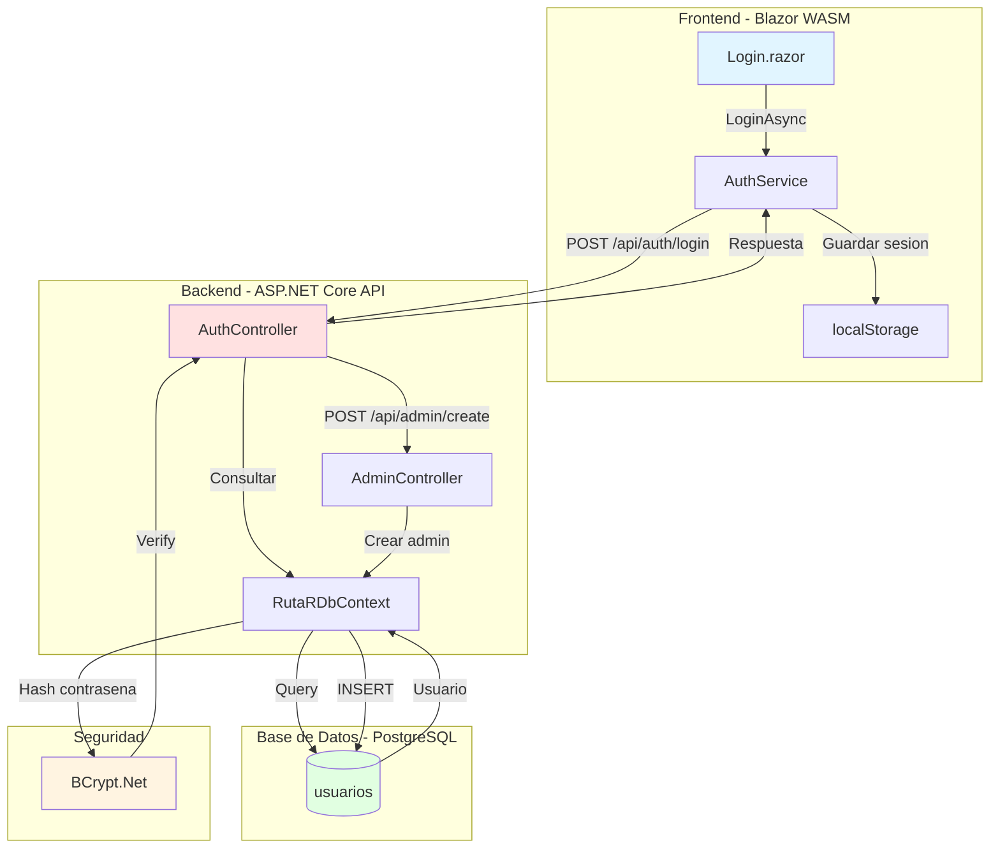
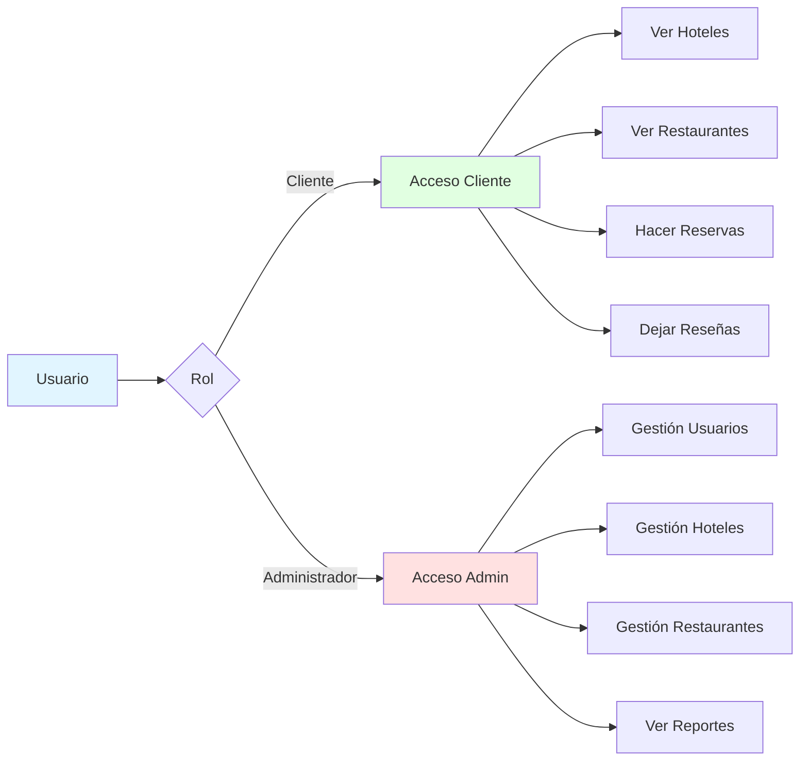

# Diagramas - RutaRD

## 1. Diagrama de Base de Datos (ER)

## 2. Diagrama de Caso de Uso - Login

## 3. Diagrama de Flujo - Registro de Usuario

## 4. Diagrama de Arquitectura - Autenticación

## 5. Diagrama de Entidades - Sistema de Roles

---

## Leyendas

- **PK:** Primary Key (Clave Primaria)
- **FK:** Foreign Key (Clave Foránea)
- **UK:** Unique Key (Clave Única)
- **||--o{:** Uno a muchos
- **POST:** Método HTTP para crear recursos
- **GET:** Método HTTP para obtener recursos
